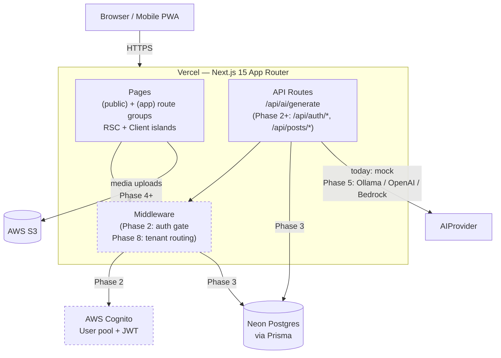

# Architecture

How FCTC Cyber Connect is put together — the layers, the data flow, and the reasons each piece exists. For the *why* behind major choices, see [decisions.md](./decisions.md).

## Overview

A Next.js 15 App Router project deployed to Vercel. The browser (mobile-first, also installable as a PWA) loads server-rendered React from Vercel's edge. Public-facing pages are statically generated; authenticated and dynamic pages render on demand. API routes inside the same repo handle AI requests, and (in later phases) auth callbacks, message-board writes, and admin actions. Data lives in Neon Postgres (Phase 3); media in S3; auth in AWS Cognito; the AI layer is a swappable provider abstraction (mock today; Ollama / OpenAI / Bedrock in Phase 5+).

## System diagram



Solid lines are wired today. Dashed boundaries (Cognito, parts of middleware) are Phase 2+ — currently stubbed.

## Layers

### Presentation

**App Router with two route groups.** `src/app/(public)/` holds marketing-style pages (`/`, `/program`, `/community`, `/resources`, `/login`, `/signup`, `/assistant`); `src/app/(app)/` holds authenticated app surfaces (`/dashboard`, `/admin`). Each group has its own `layout.tsx` that renders a tiny client-side `*ThemeDefault` component — `PublicThemeDefault` removes `.dark` if no preference is stored, `AppThemeDefault` adds it. The user's explicit toggle (stored under `localStorage["fctc-theme"]`) always wins.

**Server vs Client components.** Default is server: every page is a Server Component unless interactive state forces it client-side. Currently four files carry `"use client"`: `Nav` (drawer state, pathname matching), `ThemeToggle` (localStorage write), `AssistantPage` (chat state, fetch), and the two `*ThemeDefault` mount-effect components. Forms (`LoginPage`, `SignupPage`) are also clients because of validation state. Everything else is server-rendered.

**Design system.** Tailwind 4 with CSS-first configuration (`@theme` directive in `globals.css`). Two layers:

1. **Brand literals** — `--color-brand-navy`, `--color-brand-teal`, `--color-brand-green`, etc. Values from the official brand kit. Components don't reference these directly.
2. **Semantic tokens** — `--color-bg-base`, `--color-text-primary`, `--color-accent`, `--color-border`, etc. These point to brand literals (or to neutrals like `#f1f5f9`) and are what every component consumes. The same markup themes cleanly between light and dark because the tokens remap under `.dark`.

UI primitives in `src/components/ui/` (Button, Card, Container, Input, Badge) compose semantic tokens via the `cn()` helper (`clsx` + `tailwind-merge`).

**Layout chrome.** `Shell` wraps every page with `Nav` (sticky top, mobile drawer) and `Footer` (3-column desktop, stacked mobile). Both Nav and Footer use the brand logo via `next/image`. The root `layout.tsx` injects two synchronous inline scripts before React hydrates: a theme-init script (so dark mode doesn't flash on reload) and a service-worker registration script (App Router workaround for `next-pwa@5.6.0`).

### API

**Route handlers under `src/app/api/`.** Today: `POST /api/ai/generate`. Each route handler is a small server-only function that:

1. Reads request headers (e.g., `x-forwarded-for` for IP).
2. Checks rate limits (in-memory `Map<ip, timestamp[]>` — 10 requests / minute / IP for `/api/ai/generate`).
3. Validates request body shape (`messages` is a non-empty array; total content ≤ 10,000 chars).
4. Delegates to a domain library (`getAIProvider().generateResponse()`).
5. Returns `NextResponse.json(...)` with `200`/`400`/`429`/`500` as appropriate.

The validation, rate-limit, and provider-selection logic are all server-side — none of that ships to the browser bundle. The client just `fetch`es and reads the JSON.

Phase 2+ adds `/api/auth/*` (Cognito callbacks, session refresh) and Phase 4 adds `/api/threads/*`, `/api/posts/*`, `/api/reports/*`.

### Auth

**Phase 2 work, scaffolded only today.** Plan:

- `src/lib/auth/AuthProvider` — interface that any concrete provider implements. Cognito is the default; Auth.js is a fallback if Cognito blocks MVP.
- Server-side session checks in middleware (`src/middleware.ts` — Phase 2). Guards the `(app)` route group; unauthenticated requests redirect to `/login`.
- Role enum lives in the database (`prospective | current | alumni | admin`). Role checks happen server-side — never trust client claims.
- Session JWT verified per request; admin-only routes check the `role` claim.

For now, every app-route page renders a "Phase 2" banner indicating the auth surface is stubbed.

### Data

**Phase 3 work; mocks today.** Plan:

- **Neon Postgres** as the database, accessed via Prisma. Two connections per environment (Neon convention): `DATABASE_URL` (pooled, runtime queries) and `DIRECT_URL` (direct, migrations).
- **Schema philosophy:**
  - **Soft-delete everywhere user-facing** (`deleted_at` timestamp + `deleted_by` user reference). Threads, posts, comments, users — all soft-deleted, never hard-deleted. Restoration is just zeroing the timestamp.
  - **Audit log** (`audit_log` table). Every moderation action — delete, hide, role change, ban, FAQ edit — writes a row with actor, target, action, timestamp, reason. Append-only, never truncated.
  - **Role enum on `users`** (`prospective | current | alumni | admin`). Source of truth for authorization.
- **Mock layer today** at `src/lib/mock/` — typed to match the Phase 3 Prisma schema, with helper functions (`getAllThreads`, `getThreadsByCategory`, etc.) that respect soft-delete. The Phase 3 swap is import-source-only: components keep calling the same helpers, the helpers swap their backing data source from in-memory arrays to Prisma queries.

### AI

**AIProvider abstraction with factory.** `src/lib/ai/`:

- `types.ts` — `AIMessage`, `AIProvider` interface, `AIProviderName` union.
- `factory.ts` — reads `env.AI_PROVIDER`, returns the corresponding provider singleton. The validated env (Zod-checked at startup) means unknown values can't reach the factory; if `AI_PROVIDER=ollama` but `OLLAMA_BASE_URL` is unset, the app refuses to start.
- `providers/mock.ts` — keyword-matched canned responses about the FCTC program. Implements the full `AIProvider` interface so it's interchangeable with the real providers.
- `providers/ollama.ts`, `providers/openai.ts`, `providers/bedrock.ts` — stubs that throw `"Not yet implemented. Lands in Phase 5+."` if called. The factory still returns them for `env.AI_PROVIDER=ollama|openai|bedrock` so the wiring is exercised; they just throw on first request.

**Why this shape:** the production app should never know which provider it's talking to. The factory is the only thing that names a concrete provider; everything else takes an `AIProvider` interface. Swapping mock → Ollama → OpenAI is a config change.

**Why no LangChain:** explicit factory + thin provider classes are easier to reason about for a small app, and avoid the supply-chain surface area of the broader chain ecosystem. If the AI layer grows enough to need orchestration, we revisit.

### Storage

**S3 via the AWS SDK, Phase 4+.** Targets: profile avatars, attached images on posts, thumbnails for resources. Signed-URL upload pattern (browser uploads directly to S3 after a server-issued presigned URL) so we never proxy media bytes through Vercel.

Out of scope for Phase 1: anything S3-related. The signed-URL helpers will live in `src/lib/aws/` when they ship.

## Theme system

Two-layer design — brand literals → semantic tokens — is the only legal way for components to consume color. **No component class anywhere references a brand literal directly** (with one documented exception: the landing-page hero, which is intentionally theme-agnostic and uses `bg-brand-navy`/`text-brand-white` because it always renders dark regardless of the user's theme).

```
@theme {
  /* Brand literals (private — never used in components) */
  --color-brand-navy:  #0B1D34;
  --color-brand-teal:  #00E5FF;
  --color-brand-green: #39FF14;
  --color-brand-white: #F8FAFC;
  --color-brand-gray:  #A7B2BF;

  /* Semantic tokens (public — consumed everywhere) */
  --color-bg-base:      var(--color-brand-white);
  --color-text-primary: var(--color-brand-navy);
  --color-accent:       var(--color-brand-teal);
  --color-highlight:    var(--color-brand-green);
  /* ... */
}

.dark {
  --color-bg-base:      var(--color-brand-navy);
  --color-text-primary: var(--color-brand-white);
  --color-text-muted:   var(--color-brand-gray);
  /* ... */
}
```

Tailwind 4 generates utility classes from the tokens — `bg-bg-base`, `text-text-primary`, `text-accent`, `border-border`, `bg-accent/15` (color-mix opacity modifier on the CSS variable). The same markup re-themes by toggling `.dark` on `<html>`; no component re-renders, no class rewrites. Hybrid default per [ADR-0009](./decisions.md): public marketing surfaces start light, authenticated app surfaces start dark, the user's explicit toggle (stored in `localStorage["fctc-theme"]`) overrides both.

## Future phases

- **Phase 2 — Auth.** Cognito user pool + AuthProvider abstraction. Middleware-based gating of `(app)` routes. Role enum becomes load-bearing.
- **Phase 3 — Database.** Neon + Prisma swap. The mock layer's helper signatures stay; their implementations move to Prisma queries. Soft-delete and audit log tables go live.
- **Phase 4 — Message board.** Real thread/post/comment writes. Reports queue. Soft-delete + audit log get exercised.
- **Phase 5 — AI assistant.** Ollama provider for local development; OpenAI for cheap-cloud; Bedrock for AWS-portfolio fit. Switching is a single env var change.
- **Phase 6 — Admin panel.** Real moderation tools, user management, FAQ editor, audit log viewer.
- **Phase 7 — Polish.** Animations, error boundaries, analytics, deferred-polish items from `roadmap.md`.
- **Phase 8 — SaaS readiness.** Multi-tenant schema review (`tenant_id` foreign keys, row-level security), tenant-aware middleware (subdomain or path-based), per-tenant theming. The single-tenant Phase 1–7 architecture is intended to scale to multi-tenant without a rewrite — the type abstractions (AuthProvider, AIProvider, soft-delete) all accommodate tenant scoping cleanly.

## Cross-references

| For the *why* behind | See |
|---|---|
| npm over pnpm | [ADR-0001](./decisions.md#adr-0001-use-npm-over-pnpm) |
| ~~Cyber dark palette~~ (superseded by ADR-0008) | [ADR-0002](./decisions.md#adr-0002-superseded) |
| AIProvider abstraction with factory-only access | [ADR-0003](./decisions.md#adr-0003-aiprovider-abstraction-with-factory-only-access) |
| next-pwa over hand-rolled service worker | [ADR-0004](./decisions.md#adr-0004-next-pwa-over-hand-rolled-service-worker) |
| Node 24 LTS as the target | [ADR-0005](./decisions.md#adr-0005-node-24-lts-target) |
| Pinning Next.js 15 (not 16) | [ADR-0006](./decisions.md#adr-0006-pin-nextjs-15-not-16) |
| Accepting Tailwind 4 | [ADR-0007](./decisions.md#adr-0007-accept-tailwind-4-css-first-config) |
| Brand identity | [ADR-0008](./decisions.md#adr-0008-official-brand-identity-adopted) |
| Hybrid light/dark theme strategy | [ADR-0009](./decisions.md#adr-0009-hybrid-lightdark-theme-strategy) |
| Threat model, access control, AI governance | [security.md](./security.md) |
| Deferred items, post-MVP work | [roadmap.md](./roadmap.md) |
